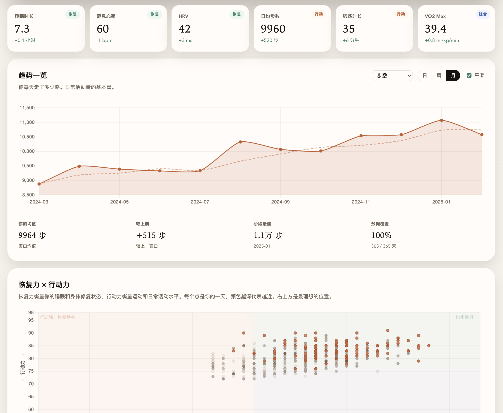
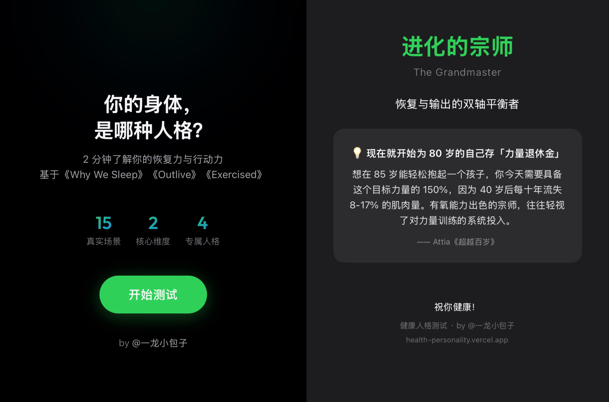

**Health Personality**

A science-backed health personality quiz — 15 scenario-based questions, 2 minutes, classifies you into one of four body-mind types with personalized recommendations.

Built on research from Walker's *Why We Sleep*, Attia's *Outlive*, and Lieberman's *Exercised*. Every question is hand-crafted from original book notes — no AI-generated quiz content.

Live demo: <https://health-personality.vercel.app>

Users: Thousands of completions via WeChat and RedNote (Xiaohongshu)





我做了一个健康人格测试，帮你了解自己的身体。15 道生活场景题，2 分钟，测完会告诉你属于四种身体人格中的哪一种，并给到专属建议。

没有用 AI 直接生成题库，一个是质感不对，AI 生成的东西容易回归平庸；二是健康科普需要尽量严谨，我希望我发出来的东西都能让阅读者有基本的信任。

因此所有题目都是对照书籍原文和我自己的笔记打磨出来的，每道题的四个选项背后有具体的科学依据，选完会展示相应的科学彩蛋，引用的都是原文。

之前也写过一些健康主题的分享笔记（流量很好哈哈，欢迎在小红书/公众号搜索：一龙小包子），也做过自己复习用的可视化 PPT 和测试题，这次算是把积累的东西整合成了一个更完整的产品形态。

四种人格没有好坏之分，跟 MBTI 一样属于偏好测试。但我们可以在能优化的地方稍微注意一下，有时几个很小的行为调整就能显著提升健康状况，ROI 超高。结果页给到的专属建议就是这种很轻的、原子习惯式的、比较有可能真正执行起来的实用小 tips。

我的个人简介写的是「关心 AI，更关心人类；提升智能，也磨练身体」，这个小产品算是一次很好的结合了。AI 生产力杠杆拉满的时代，健康是我们最重要的基础设施。

希望能帮你更了解自己的身体偏好，找到更适合自己的改善方式。欢迎交流反馈，欢迎测试分享。

祝你健康！

在线地址：<https://health-personality.vercel.app>

## 你会看到什么

- 15 道生活场景题
- 四种健康人格结果
- 每题对应的科学彩蛋
- 结果页专属建议与分享卡片
- 纯静态单页，已接入 Vercel Web Analytics

## 项目特点

- 题库不是 AI 直接生成
- 所有题目都基于书籍原文和作者笔记打磨
- 每道题四个选项背后都有明确依据
- 适合直接体验，也适合作为健康内容产品原型参考

## 版权说明

版权所有 © 2026 KingJing1 ([@一龙小包子](https://x.com/KingJing001))。

本项目采用 MIT License，详见 `LICENSE`。

## 内容

- 健康人格测试
- 结果页与行动建议
- 分享卡片导出
- 已接入 Vercel Web Analytics

## 本地打开

这是一个纯静态页面，直接用浏览器打开 `index.html` 即可。

```bash
open index.html
```

## 部署

当前线上版本部署在 Vercel：<https://health-personality.vercel.app>

如果要自行部署，可以把仓库作为静态站点导入 Vercel，或直接部署根目录下的 `index.html`。

## 文件

- `index.html`：页面源码
- `assets/readme1.png`：README 展示图 1
- `assets/readme2.jpg`：README 展示图 2
- `LICENSE`：MIT 许可证

## License

MIT
